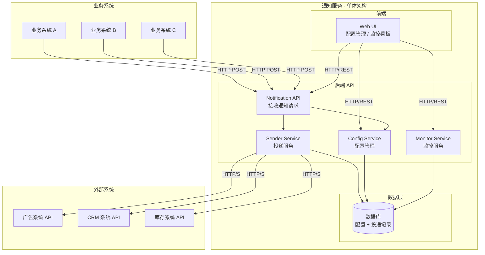
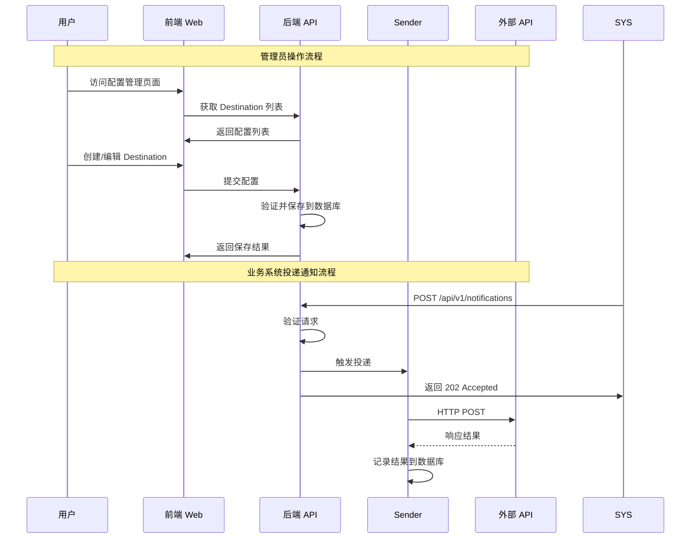
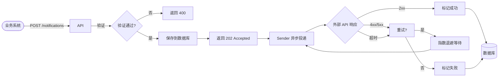

## Context

企业内部多个业务系统（微服务）需要在关键业务事件发生时通知外部第三方系统。当前各业务系统直接调用外部 API 存在高度耦合、可靠性无保障、监控分散等问题。

**当前痛点：**
- 业务系统需直接维护每个外部 API 的调用代码，包括认证、请求格式等
- 网络抖动或外部服务不可用时，通知直接丢失
- 各系统独立实现，缺乏统一的投递状态追踪

**关键约束：**
- 发送方（内部微服务）：技术栈不统一，直接访问外部 URL 能力不一致
- 接收方（外部 API）：不可控，可能无多环境，HTTP 存在中间人攻击风险
- 业务系统不关心外部 API 返回值，只关心通知是否送达
- **优先保证简单**，避免过度设计
- **采用单体架构 + 前后端分离**，简化部署和运维

## 系统架构图

### 整体架构

### 前端后端交互流程

### 投递流程

## Goals / Non-Goals

**Goals:**
- 提供统一的 API 通知接入层，业务系统只需按标准格式投递
- 保证通知至少投递一次（at-least-once）
- 支持同步投递（等待外部 API 响应）和异步投递（后台重试）
- 提供完整的投递状态追踪和失败告警
- 集中管理外部 API 配置（地址、认证、超时，重试策略）
- 提供 Web UI 用于配置管理和监控看板

**Non-Goals:**
- 不处理外部 API 的返回值（业务系统不关心 response body）
- 不实现复杂的消息路由（固定 1:1 映射，通知 → 目标 API）
- 不处理外部 API 的回调（单向通知）
- **暂不引入消息队列**（RabbitMQ/RocketMQ）- 未来流量激增时再引入
- **暂不引入死信队列** - 失败重试足够应对时暂不需要

## Decisions

### Decision 1: 架构模式 - 单体架构 + 前后端分离

**选择：单体架构，前端后端分离部署**

**理由：**
- 第一版量级未知，微服务架构增加复杂度
- 单体架构开发、部署、运维更简单
- 前后端分离便于独立迭代，前端专注 UI，后端专注业务
- 如果未来复杂度显著增加，可以拆分为独立服务

**模块划分：**
- **前端**：Vue/React SPA，提供配置管理和监控看板
- **后端**：Go/Java/Node.js，提供 RESTful API
- **数据库**：SQLite/PostgreSQL，存储配置和投递记录

### Decision 2: 前端技术选型

**选择：Vue 3 + Vite 或 React + Next.js**

**理由：**
- 主流前端框架，生态成熟
- SPA 适合内部工具类应用
- 如果需要 SEO 可考虑 Next.js

### Decision 3: 后端技术选型

**选择：Go**

**理由：**
- 高性能、低内存占用
- 内置 HTTP 服务器，开发简单
- 适合轻量级 API 服务
- 如果团队熟悉 Java/Node.js 也可接受

### Decision 4: 数据库选型

**选择：SQLite（开发/小规模）/ PostgreSQL（生产）**

**理由：**
- SQLite 零配置，适合开发和小型部署
- PostgreSQL 支持高并发，适合生产环境
- 均为关系型数据库，事务支持好

### Decision 5: 消息投递语义 - At-Least-Once

**选择：At-Least-Once（至少一次）**

**理由：**
- 外部 API 通知通常为幂等操作（如更新 CRM 状态）
- 业务优先保证不丢消息，接受少量重复
- 实现复杂度适中，重试机制成熟

### Decision 6: 重试策略 - 指数退避 + 最大次数

**选择：指数退避，最大 5 次重试**

**参数：**
- 基础延迟：1s
- 退避倍数：2
- 最大延迟：60s
- 最大重试：5次

### Decision 7: 认证方式 - 配置化支持多种认证

**选择：配置中心统一管理认证信息**

- API Key、Bearer Token、Basic Auth、OAuth2
- 敏感信息加密存储

### Decision 8: 监控方案 - Prometheus + Grafana

**选择：基于 Prometheus metrics 暴露指标**

- notifications_sent_total
- notifications_delivered_total
- notifications_failed_total
- notification_delivery_duration_seconds

## Risks / Trade-offs

**[Risk] 外部 API 响应慢导致请求积压**
→ **Mitigation**: 设置合理的超时时间，使用异步处理避免阻塞

**[Risk] 重试次数耗尽后通知丢失**
→ **Mitigation**: 记录所有失败通知的状态和原因，支持人工排查和重试

**[Risk] 单体架构扩展性差**
→ **Mitigation**: 合理设计模块边界，未来可平滑拆分为微服务

## Migration Plan

**Phase 1: 项目基础**
1. 搭建前端项目（Vue/React）
2. 搭建后端项目（Go）
3. 集成数据库

**Phase 2: 核心功能**
4. 实现配置管理 API + 前端页面
5. 实现通知接收 API
6. 实现 Sender 投递功能
7. 实现重试机制

**Phase 3: 监控功能**
8. 实现 metrics 端点
9. 实现监控看板前端
10. 配置告警规则

**Phase 4: 生产就绪**
11. 完善加密存储
12. 编写文档
13. 业务系统接入

## Open Questions

1. **外部 API 超时设置**：统一默认值 vs 可配置？
2. **多环境支持**：是否需要区分 dev/staging/prod？
3. **幂等 ID 生成**：如何生成全局唯一 ID？

## 演进规划

| 触发条件 | 引入方案 |
|----------|----------|
| 通知量 > 1000/秒 | 引入 RabbitMQ 消息队列 |
| 失败通知需人工处理 | 引入死信队列 |
| 需要更高可用性 | 水平扩展 + 负载均衡 |
