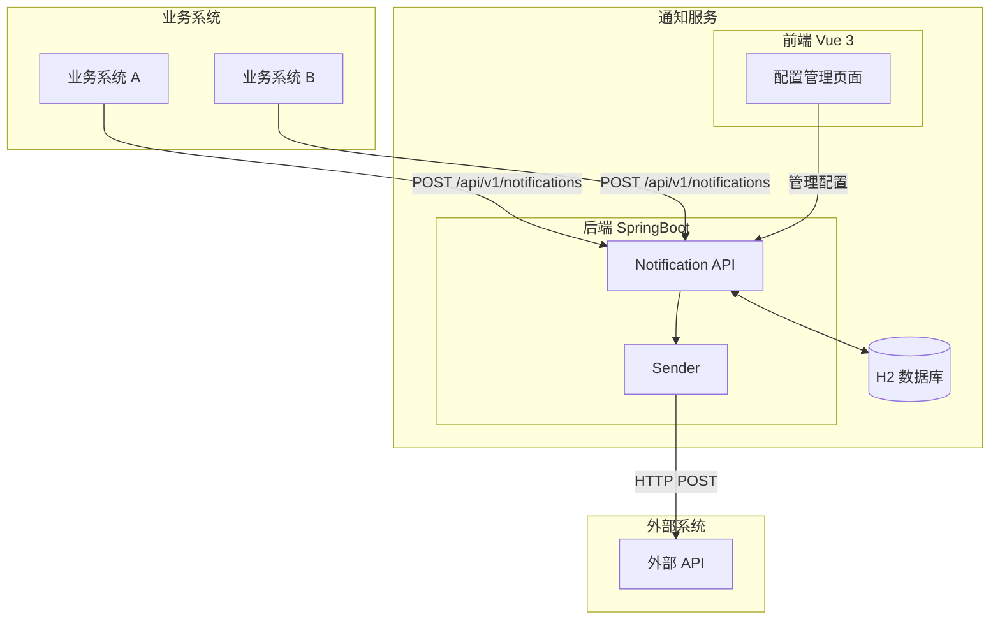

## Context

企业内部多个业务系统需要在关键业务事件发生时调用外部供应商的 HTTP(S) API 进行通知。当前各业务系统直接调用外部 API 存在耦合严重、可靠性无保障等问题。

**MVP 目标：**
- 业务系统能通过 HTTP POST 发送通知到外部 API
- 支持简单的重试机制
- 集中管理 Destination 配置
- 提供基础的状态查询

## 系统架构图



## Goals / Non-Goals

**MVP Goals:**
- 业务系统可通过 HTTP POST 发送通知
- 支持 API Key 认证方式
- 支持 3 次简单重试（固定间隔）
- Destination 配置管理（CRUD）
- 通知状态查询

**Non-Goals (后续优化):**
- 多种认证方式（Bearer/Basic/OAuth2）
- 模板引擎（Mustache 变量替换）
- 动态 Header 替换
- 指数退避重试
- 前端登录认证
- 监控面板
- 限流

## Decisions

### Decision 1: 简化认证方式

**MVP 只支持 API Key**

理由：
- 最常用的认证方式
- 实现简单，验证快速
- 其他认证方式作为后续优化

### Decision 2: 简化重试策略

**固定间隔重试 3 次**

理由：
- 足够应对大多数临时故障
- 实现极简
- 后续可升级为指数退避

### Decision 3: 简化 Body 配置

**固定 JSON Body，占位符替换**

```json
{
  "user_id": "{{user_id}}",
  "event": "{{event}}"
}
```

理由：
- 满足大多数场景
- 实现简单（字符串替换）
- 后续可升级为完整模板引擎

### Decision 4: 简化 Header 配置

**仅支持静态 Header**

理由：
- 大多数外部 API 只需要静态 Header
- 动态 Header 作为后续优化

## 演进规划（优先级排序）

| 优先级 | 后续功能 | 触发条件 |
|--------|----------|----------|
| P0 | API Key 认证 | 当前 MVP |
| P1 | 模板引擎（变量替换） | 需要动态 body |
| P1 | 指数退避重试 | 需要更智能的重试 |
| P2 | Bearer Token 认证 | 特定 API 需求 |
| P2 | 动态 Header | 特定 API 需求 |
| P2 | 监控面板 | 运营需求 |
| P3 | 限流 | 防止外部 API 被刷 |
| P3 | 前端登录 | 安全要求 |
